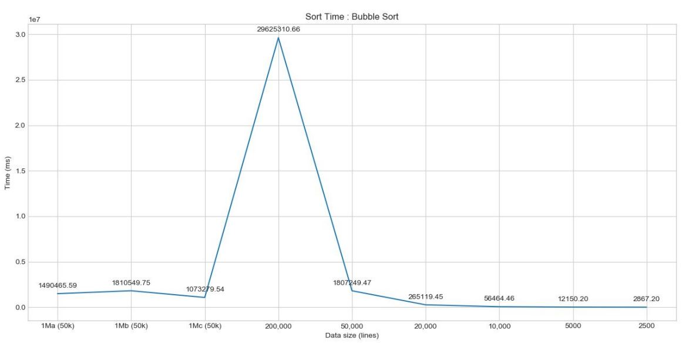
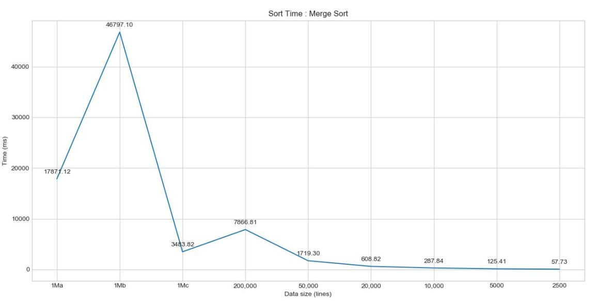
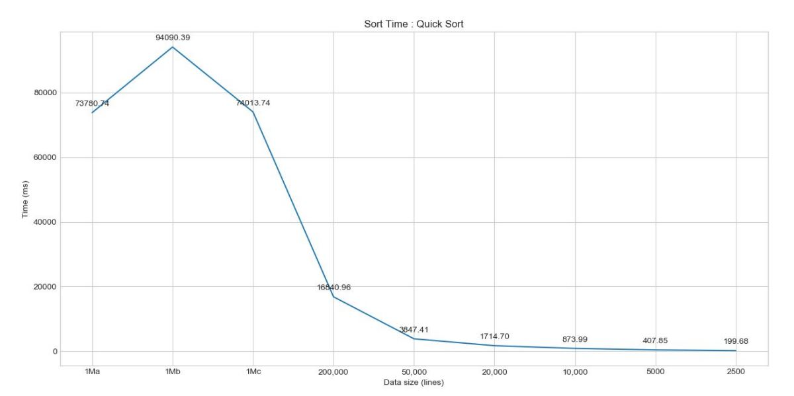

# Algorithms
 This repository contains different algorithms implemented as part of coursework at NCSU
 
## __Sorting__

In this assignment, 3 sorting algorithms were implemented: bubble sort, quick sort, and
merge sort and compared again files of different sizes starting from 2500 lines to 1 million lines

The following plots are recorded for growth of sorting time as a function of data size:

Note, that in bubble sort, for 1Ma, 1Mb, 1Mc, only 50000 lines are used due to
excessive time requirements. Also, 1Ma, Mb and 1Mc files have 1 million lines with different configurations

## __Regular Expressions__

Design and implement solutions for the following problems. 

_DIALOG_: Given a list of input files similar to the sample files (but not previously known), extract
all the dialog into a separate output file. In the output, retain the quotation or other
marks that separate the dialog from the narrative.

_DIALOG SEARCH_: Given one input file similar to the sample files (but not previously known),
and a search string, determine if the search string appears within dialog in the sample
file. If it does, then output each Chapter number/title (equivalently for anthologies,
the number/name of the individual work) in which the search string appears.
Example:

_DIALOG_

To run the script, navigate to the appropriate folder and run the script dialogscript.py

The result of running this script is as follows:  
`File output successful with file name outputdracula.txt`     
`File output successful with file name outputsh.tx`   

These files contains all the dialog sepearated into a separate output file.

_DIALOG SEARCH_

To run the script, navigate to the appropriate folder and run the script dialogsearchscript.py

The result of running this script is as follows:  
`filename : dracula.txt`   
`search string : red eyes`   
`Found in CHAPTER VII CUTTING FROM "THE DAILYGRAPH," 8 AUGUST`   
`Found in CHAPTER VII CUTTING FROM "THE DAILYGRAPH," 8 AUGUST`   
`Found in CHAPTER XI Lucy Westenra's Diary.`   
`Found in CHAPTER XIX JONATHAN HARKER'S JOURNAL`   
`Found in CHAPTER XXVII MINA HARKER'S JOURNAL`   

## __Diff using dynamic programming approach to Longest Common Subsequence__

This assignment had the following three parts:
* Implement a hash function for strings. Use a modulo function to compress the resulting value to 10 bits, i.e. to be in the range [0, 1023]. 
* Use your hash function to implement a hashfile program that takes a filename on
the command line and produces a 10-bit hash of each line. 
* Implement the dynamic programming algorithm for diff, using the dynamic programming
approach to the Longest Common Subsequence problem. Use the code from your hashfile
implementation. 

## __ShortestPath using BFS__

Finding the 4-, 8-, or m-shortest path in an image (graph)  

* Input arguments: an image, a predefined set V, two pixel locations p and q
inside the image, the path type (4-, 8-, or m-path)
* Outputs: the length of the shortest path, and the path (i.e., the sequence of
pixels)

